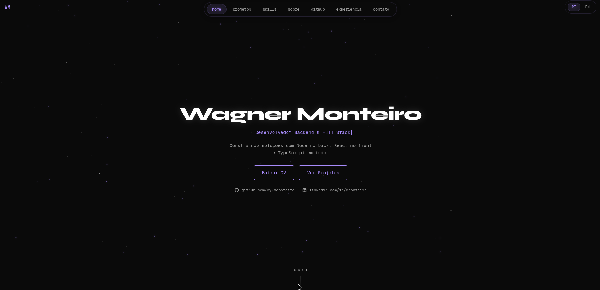

<div align="center">

# Moonteiro — Portifólio

[](https://nextjs.org/)
[](https://react.dev/)
[](https://www.typescriptlang.org/)
[](https://tailwindcss.com/)
[](https://next-intl.dev/)
[](https://docs.github.com/en/rest)
[](https://www.conventionalcommits.org/)

</div>

---

## Sobre

Portifólio pessoal desenvolvido com **Next.js + TypeScript**, com foco em organização de código, manutenção e evolução contínua.

Meu posicionamento profissional é **full stack**, com **maior foco em backend**.  
Este projeto representa minha camada de apresentação no frontend, priorizando clareza e estrutura.

Acesse o portifólio online em: `https://moonteiro.vercel.app/`

---

## Preview

<details open>
<summary>Sessão do Hero</summary>

<br/>

<div align="center">
  
</div>

</details>

## Principais pontos

- Projeto bilíngue com **next-intl** (pt/en)
- Integração com API externa do **GitHub**
- Código organizado por responsabilidade
- Commits padronizados com **Conventional Commits**
- Base pronta para expansão de conteúdo e features

---

## Stack

- Next.js 16
- React 19
- TypeScript 5.x
- Tailwind CSS 4
- Framer Motion
- Lucide React / React Icons
- next-intl

---

## Estrutura de pastas

<details open>
<summary>Ver estrutura de arquivos</summary>

```
.
├── messages/            # textos de internacionalização (pt/en)
├── public/
│   ├── preview/         # Imagens de preview do portfólio
│   ├── projetos/        # Logos dos projetos
│   └── ...._cv.pdf      # CV em PDF
├── src/
│   ├── app/             # rotas e estrutura principal (App Router)
│   ├── components/      # componentes reutilizáveis de UI
│   ├── i18n/            # configuração de localização
│   ├── lib/             # utilitários e integrações (ex.: API)
│   └── proxy.ts         # camada de apoio para requests
├── eslint.config.mjs
├── next.config.ts
├── package.json
└── tsconfig.json
```

</details>

---

## Como rodar localmente

```bash
git clone https://github.com/By-Moonteiro/portifolio.git
cd portifolio
pnpm install
pnpm dev
```

Acesse: `http://localhost:3000`

> Também funciona com `npm install` + `npm run dev`.

---

## Decisões de engenharia

- Estrutura modular para evitar acoplamento desnecessário
- Separação entre conteúdo, UI e integrações
- Uso de IA como apoio de produtividade e implementação, com adaptação manual para o contexto do projeto

---
